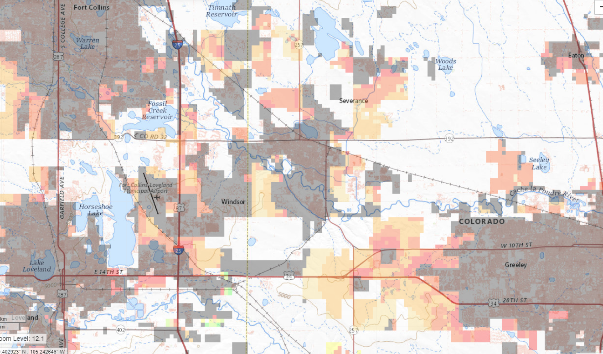

# Colorado Agricultural Water Transfer #

This website provides information about potential agricultural water transfers in Colorado,
currently focusing on water transfers along the Colorado Front Range.

## Overview ##

Colorado's Front Range continues to experience population growth.
The Front Range population added approximately 600,000 people in the decade from 2000 to 2010
and is projected to add another 3 million people in the next four decades.
The projected growth means that the Front Range population will have doubled from 2000 to 2050.

In the past, significant dry-up of agricultural lands has occurred along the Front Range,
with the transfer of water supplies from agricultural to municipal use,
to fulfill the needs of population growth and housing development.
There is a growing sentiment among Colorado water leaders that we
cannot grow in the future the way that we have grown in the past.
There are options as to how land development occurs in each community
and to what extent the dry up of agricultural lands occurs.
Options include denser growth, changes in water dedications,
and flexibility in assuring municipal water supplies and reserves.

In partnership with the [Environmental Defense Fund (EDF)](https://www.edf.org/),
[WestWater Research (WWR)](https://www.waterexchange.com/)
evaluated economic aspects of [Alternative Water Transfer Methods (ATMs)](https://cwcb.colorado.gov/focus-areas/supply/alternative-transfer-methods).
This work has contributed important insights into the challenges and opportunities for ATM development in Colorado.
The primary state policy objective behind ATMs is to reduce the permanent
dry-up of agricultural lands due to municipal water supply acquisitions,
particularly along the Colorado Front Range, which has high population growth and agricultural production.
An important aspect of understanding the opportunity for ATMs is to understand
the drivers behind municipal growth and water acquisitions.
In 2018, WWR worked with EDF to develop an analysis of municipal growth and municipal
water supply shortages for the Front Range to the year 2050.
The analysis was both a water balance of individual municipal water providers and a spatial analysis to
map what land development and agricultural dry-up might look like under various future scenarios.
The analysis provides a better understanding of both the opportunity and benefits of ATMs for the Front Range.

While the analysis provides a better understanding of ATMs,
it also requires estimates about future population growth, land development,
and municipal water supplies that are inherently difficult to predict.
There is a broader and more powerful benefit to be gained from the analytical tools developed by
WWR by creating a public and open dashboard for evaluating alternative futures for the Front Range.
The [Open Water Foundation (OWF)](http://openwaterfoundation.org/) has subsequently automated the analysis and
implemented this website to publish analysis input and results.

## Analysis Results ##

The following image illustrates municipal growth and corresponding land development,
with colors indicating the year of estimated development.
Use the ***Baseline Scenario / Land Development*** menu to view analysis results in an interactive map.

## Web Application Menus ##

The following main menus are provided.
An online dashboard with maps and charts allows any user to better understand municipal growth,
land development, and agricultural dry-up for the Front Range.

| **Menu** | **Description** |
| -- | -- |
| ***Supporting Data*** | Input data needed by the analysis.  Menus that end in ***(\*)*** are proposed features and have been implemented in limited form to illustrate potential enhancements. |
| ***Baseline Scenario*** | Baseline analysis scenario using simple assumptions across the Front Range.  See the ***Synopsis*** menu item for a summary of the analysis. |
| ***Scenario 1*** | A placeholder for specific analysis scenario.  Enhancements to this web application may implement one or more scenarios. |
| ***Resources*** | Additional useful resources. |
